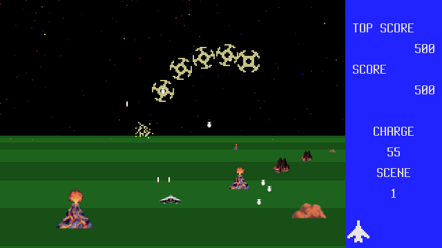

# Extranion

This is a retro shoot 'em up game inspired by MSX Exerion.

The game is a simple 2D game where the player controls a spaceship and shoots down enemy spaceships.

The mechanics are simple, kill all of them!
You gain points and charge by killing enemies. Charge can be used for rapid fire. Dont waste it!

# TODO

  DEPRECATION: Legacy editable install of extranion==0.1 from file:///srv/git/extranion (setup.py develop) is deprecated. pip 25.0 will enforce this behaviour change. A possible replacement is to add a pyproject.toml or enable --use-pep517, and use setuptools >= 64. If the resulting installation is not behaving as expected, try using --config-settings editable_mode=compat. Please consult the setuptools documentation for more information. Discussion can be found at https://github.com/pypa/pip/issues/11457
